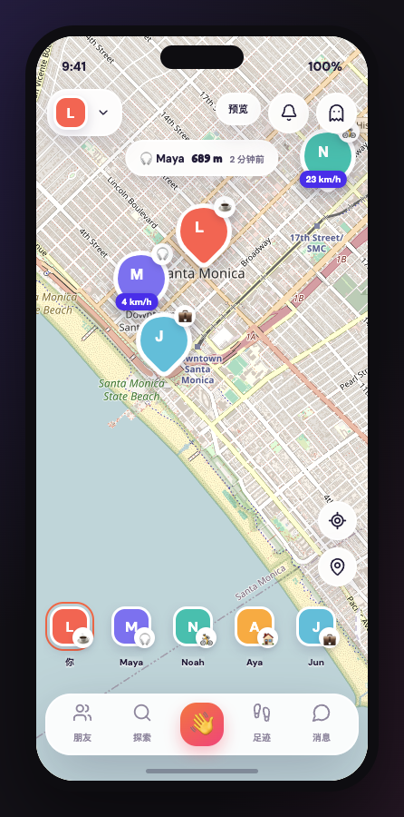

# Pinpop

A Zenly-style social map. Friends show up live, you can wave, chat, and see
who is actually sharing. The same React UI is the website **and** the App Store
app (Capacitor). GitHub Pages is only the invite link for people who do not
have the app yet.

<p align="center">
  
</p>

<p align="center">
  <a href="https://william101102.github.io/zenly-app/?preview=1">Open the live preview</a>
  · no account needed
</p>

Green rings mean someone is sharing a live fix. Gray rings mean they hid their
location or have not moved in a while.

## Run it locally

You need Node 20+ and npm.

```bash
git clone https://github.com/William101102/zenly-app.git
cd zenly-app
npm install
npm run dev
```

Then open [http://127.0.0.1:5173/?preview=1](http://127.0.0.1:5173/?preview=1).

On a laptop the page is a phone frame (that is the app, not a marketing site).
`?preview=1` loads demo friends around Santa Monica so you can click around
without Supabase keys.

```text
npm run test        # unit tests
npm run typecheck   # TypeScript
```

### Real accounts (optional)

The preview above is enough to see the product. To sign in for real:

1. Copy `.env.example` to `.env.local` and put in your Supabase URL + anon key.
2. Run `backend/supabase/setup.sql` in the Supabase SQL editor.
3. Restart `npm run dev` and open [http://127.0.0.1:5173/](http://127.0.0.1:5173/)
   (no `?preview=1`).

| Variable | Where |
|---|---|
| `VITE_SUPABASE_URL` | `.env.local` and GitHub Actions vars |
| `VITE_SUPABASE_ANON_KEY` | same |
| `VITE_PUBLIC_APP_URL` | optional; invite links when running inside the app |

## iOS / App Store

Same UI, wrapped as `com.pinpop.app`. Full steps:
[`ios-setup/README.md`](ios-setup/README.md).

```text
src/                         React UI (web + native)
ios-setup/                   Info.plist permissions, icons, URL scheme
backend/supabase/            Schema, RLS, push edge function
docs/preview.png             Screenshot used in this README
```
